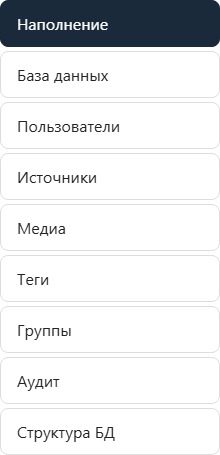
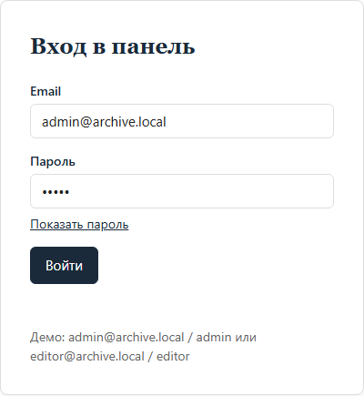
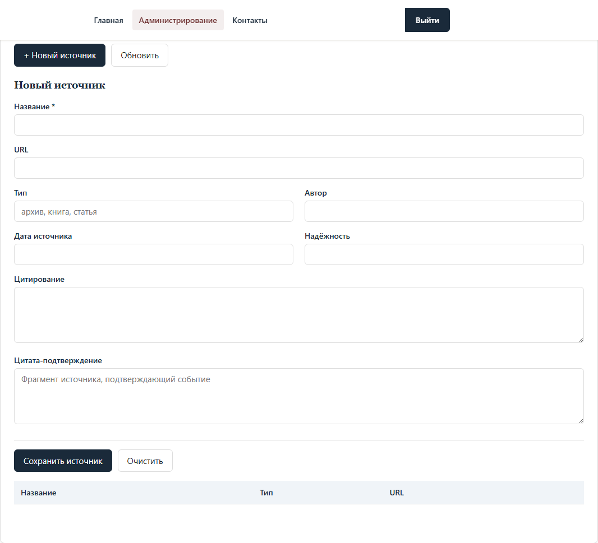
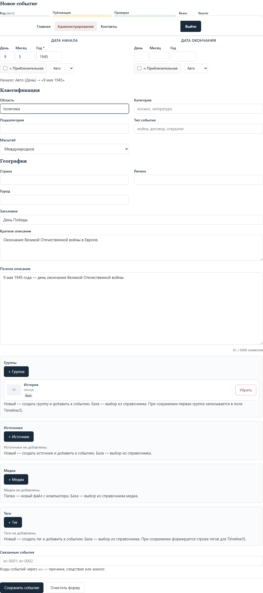
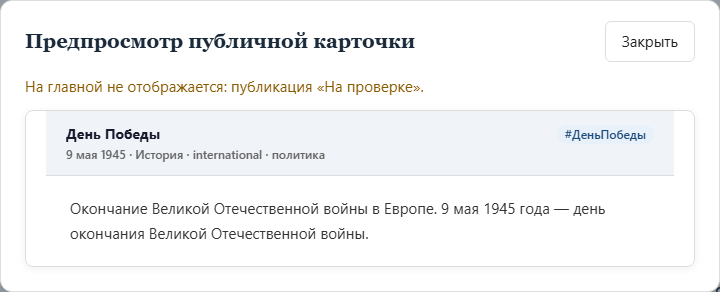
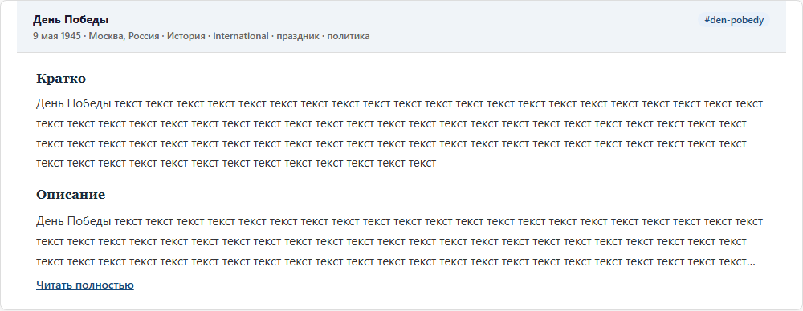

# Ручное занесение данных в базу

Пошаговая инструкция для редакторов и администраторов проекта «Архив истории».

Данные хранятся в SQLite (`data/archive.sqlite3`). Ввод выполняется через веб-админку — **не** через прямое редактирование JSON или CSV.

Связанный документ: [open-spec.md](../open-spec.md)

Версия для Word: [instrukciya-ruchnogo-vvoda.docx](instrukciya-ruchnogo-vvoda.docx) (пересобрать: `python scripts/export_manual_entry_docx.py`).

**Скриншоты** в папке `images/` сняты с реального интерфейса (`http://127.0.0.1:8000`). Чтобы обновить после изменений вёрстки:

```powershell
python server.py
python scripts/capture_manual_entry_screenshots.py
```

---

## Общая схема



1. Запустить локальный сервер `python server.py`.
2. Открыть админку и войти под учётной записью.
3. Заполнить справочники (источники, медиа, теги, группы) — при необходимости.
4. Создать или отредактировать событие.
5. Проверить предпросмотр и выставить **Публикация** + **Проверка**.
6. Убедиться, что событие появилось на главной странице.

---

## Перед началом

### Запуск сервера

В терминале перейдите в папку проекта и выполните:

```powershell
python server.py
```

Должно появиться сообщение:

```text
Server: http://127.0.0.1:8000
```

### Как открывать сайт

| Страница | Адрес |
| --- | --- |
| Главная (таймлайн) | http://127.0.0.1:8000/ |
| Админка | http://127.0.0.1:8000/admin.html |

> **Важно.** Не открывайте `index.html` или `admin.html` двойным кликом с диска (`file://...`). Без сервера страницы не загрузят данные из базы.

### Демо-учётные записи

| Email | Пароль | Роль | Что может делать |
| --- | --- | --- | --- |
| `admin@archive.local` | `admin` | Администратор | Всё: события, справочники, пользователи, аудит, схема БД |
| `editor@archive.local` | `editor` | Редактор | События и справочники, без пользователей и аудита |

---

## Шаг 1. Вход в админку

1. Откройте http://127.0.0.1:8000/admin.html
2. Введите email и пароль.
3. Нажмите **Войти**.



Если вход не удаётся — проверьте, что сервер запущен и страница открыта по адресу `127.0.0.1:8000`, а не с диска.

---

## Шаг 2. Справочники (рекомендуется сначала)

Перед событием удобно создать связанные записи в справочниках. Тогда их можно привязать к событию через кнопки **+ Источник**, **+ Медиа**, **+ Тег**, **+ Группа**.

Разделы в верхнем меню:

- **Источники** — книги, архивы, статьи, ссылки.
- **Медиа** — изображения, видео, документы (по URL или после загрузки в `data/uploads/`).
- **Теги** — тематические метки.
- **Группы** — полосы таймлайна (например, «История», «Культура»).



### Источник

1. Откройте вкладку **Источники**.
2. Нажмите **+ Новый источник**.
3. Заполните поля:

| Поле | Обязательно | Пример |
| --- | --- | --- |
| Название | Да | Государственный архив РФ |
| URL | Нет | https://rgantd.ru/ |
| Тип | Нет | архив |
| Автор | Нет | — |
| Дата источника | Нет | 2020 |
| Надёжность | Нет | 8 |
| Цитирование | Нет | ГАРФ. Ф. 1234... |
| Цитата-подтверждение | Нет | Фрагмент текста, подтверждающий факт |

4. Нажмите **Сохранить источник**.

Поле **Цитата-подтверждение** (`evidence_quote`) показывается на публичной карточке рядом с источником.

### Медиа

1. Откройте вкладку **Медиа**.
2. Нажмите **+ Новое медиа** или привяжите файл к событию через **+ Медиа → Папка** в форме события.
3. Заполните:

| Поле | Обязательно | Пример |
| --- | --- | --- |
| URL | Да | `/data/uploads/photo.jpg` или `https://...` |
| Тип | Нет | image |
| Подпись | Нет | Парад Победы, 1945 |
| Автор / источник | Нет | ТАСС |

4. Нажмите **Сохранить медиа**.

### Тег

1. Откройте вкладку **Теги**.
2. Нажмите **+ Новый тег**.
3. Заполните **Название** (обязательно), **Slug** и **Описание** — по желанию.
4. Нажмите **Сохранить тег**.

### Группа

1. Откройте вкладку **Группы**.
2. Нажмите **+ Новая группа**.
3. Заполните **Название** (обязательно), **Slug** и **Описание**.
4. Нажмите **Сохранить группу**.

При сохранении события первая выбранная группа записывается в поле TimelineJS `group`.

**Иерархия групп.** Справочник двухуровневый: 5 основных групп (Общество, Политика, Экономика, Военные действия, Наука) и подгруппы (`parent_id`). В выборе групп подгруппы показаны с отступом `└` и подписью родителя. Правило: событию назначайте **наиболее специфичную** подходящую группу (подгруппу, если есть). Таксономия — в `docs/open-spec-country-lanes.md`, п. 6.

**Массовое назначение группы.** В разделе «База данных» отметьте события чекбоксами → в панели массовых действий выберите группу → «Назначить группу». Каждая правка попадает в аудит.

**Отчёт покрытия.** Кнопка «Отчёт покрытия (страны × годы)» в разделе «База данных» показывает, по каким странам и годам архив пуст («—» — пробел наполнения).

---

## Шаг 3. Создание события

1. Откройте вкладку **Наполнение**.
2. Нажмите **+ Новое событие**.
3. Заполните форму.



### Верхняя строка (статус и метаданные)

| Поле | Пояснение |
| --- | --- |
| Код | Генерируется автоматически (`ev-0001` …). Не меняйте без необходимости. |
| Публикация | Видимость на сайте: черновик / на проверке / опубликовано. |
| Проверка | Надёжность данных: не подтверждено, требует проверки, спорно, проверено. |
| Важн. | Число от 1 до 10. |
| Хештег | Короткая метка без пробелов; `#` при вводе необязателен. |

Подсказка под строкой сообщает, попадёт ли событие на главную.

**На главную попадают только записи с Публикация = «Опубликовано» и Проверка = «Проверено».**

| Публикация | Проверка | На главной? |
| --- | --- | --- |
| Опубликовано | Проверено | **Да** |
| Опубликовано | Требует проверки / Спорно / Не подтверждено | Нет (сохранение отклонится) |
| На проверке | любая | Нет |
| Черновик | любая | Нет |

### Даты

Два блока: **ДАТА НАЧАЛА** и **ДАТА ОКОНЧАНИЯ**.

| Строка | Поля |
| --- | --- |
| 1-я | День, Месяц, Год (год начала обязателен) |
| 2-я | ≈ Приблизительная, точность (Авто / День / Месяц / Год / Приблизит.) |

Под блоком дат — подсказка с итоговым форматом даты (диапазон, ≈, точность).

### Классификация и география

| Поле | Пример |
| --- | --- |
| Область | политика, наука, культура |
| Категория | космос, литература |
| Подкатегория | — |
| Тип события | война, договор, открытие |
| Масштаб | local / national / regional / international |
| Страна (место), Регион, Город | Россия, Москва |
| Страны-участники | СССР; Германия |

**Страна (место) ≠ Страны-участники.** «Страна» — где произошло событие (несколько — через запятую). «Страны-участники» — кто участвовал (через `;`): именно по участникам строятся полосы сравнения стран на таймлайне. Пример: нападение Германии на СССР — место «СССР», участники «Германия; СССР». Для длительных событий заполняйте дату окончания — сервер не примет окончание раньше начала и интервал длиннее 30 лет.

### Тексты

| Поле | Обязательно | Лимит |
| --- | --- | --- |
| Заголовок | **Да** | — |
| Краткое описание | Нет | 500 символов — на карточке блок «Кратко» |
| Полное описание | Нет | 5000 символов — блок «Описание», сворачивается на главной |

### Связи со справочниками

В форме — списки выбранных записей и кнопки с меню:

| Кнопка | Пункты меню |
| --- | --- |
| **+ Группа** | Новый / База |
| **+ Источник** | Новый / База |
| **+ Медиа** | Папка (загрузка файла) / База |
| **+ Тег** | Новый / База |

**Новый** — создать запись в модальном окне и сразу привязать к событию.  
**База** — выбрать из справочника.  
**Папка** — загрузить изображение в `data/uploads/` через `POST /api/media/upload`.

Строковое поле `tags` в базе заполняется автоматически из выбранных тегов; вручную в форме его нет.

### Связанные события

Поле **Связанные события** — коды через `;` или `,` (например, `ev-0001;ev-0002`).

---

## Шаг 4. Предпросмотр перед публикацией

1. Заполните форму события.
2. Нажмите **Предпросмотр карточки**.



В окне отображается приближённый вид публичной карточки: заголовок, дата, описание, связанные источники, медиа и теги.

Пока окно открыто, содержимое обновляется при изменении полей.

Предупреждение появится, если событие **не готово** к главной (не опубликовано или не проверено).

Закрыть: **Закрыть**, клик по фону или **Esc**.

> Предпросмотр в админке пока не повторяет разделение «Кратко» / «Описание» с кнопкой раскрытия — на главной странице вёрстка актуальнее.

---

## Шаг 5. Сохранение

1. Проверьте обязательные поля: **год начала** и **заголовок**.
2. Убедитесь: **Опубликовано** + **Проверено** (если нужна главная).
3. Нажмите **Сохранить событие**.
4. Дождитесь сообщения «Событие сохранено в БД».

После сохранения сервер автоматически:

- записывает данные в SQLite;
- пересобирает `data/timeline_data.json` и `data/scale_data.json` (только `published` + `verified`);
- фиксирует действие в журнале аудита.

---

## Шаг 6. Проверка на главной странице

1. Откройте http://127.0.0.1:8000/
2. Найдите событие на таймлайне или через **Перейти к дате**.
3. Убедитесь, что карточка факта показывает заголовок, блок **Кратко**, свёрнутое **Описание**, источники и теги.



Если события нет:

- **Публикация** = Опубликовано **и** **Проверка** = Проверено;
- обновите страницу (Ctrl+F5).

---

## Редактирование и удаление

### Редактирование

1. В таблице событий (внизу раздела **Наполнение**) нажмите **Изменить**.
2. Внесите правки.
3. Нажмите **Сохранить событие**.

### Удаление

1. Нажмите **Удалить** в строке события.
2. Подтвердите действие.

Удаление необратимо.

---

## Роли и доступ

| Раздел | admin | editor |
| --- | --- | --- |
| Наполнение (события) | ✓ | ✓ |
| Источники, Медиа, Теги, Группы | ✓ | ✓ |
| Пользователи | ✓ | — |
| Аудит | ✓ | — |
| База данных | ✓ | — |

---

## Частые проблемы

### Страница не загружается / пустой таймлайн

- Запущен ли `python server.py`?
- Открыт ли сайт по `http://127.0.0.1:8000/`?

### Событие сохранено, но не видно на главной

- Нужны **Опубликовано** и **Проверено**.
- Обновите главную (Ctrl+F5).

### Ошибка при сохранении «Опубликовать можно только проверенные…»

- При публикации выберите **Проверка** = **Проверено**.

### Не удаётся войти

- Сервер запущен, адрес `http://127.0.0.1:8000/admin.html`, верный email/пароль.

### Справочник не появляется в списке

- Сохраните запись в разделе справочника.
- Нажмите **Обновить из БД** в **Наполнение** или обновите страницу.

---

## Что не нужно редактировать вручную

| Файл | Почему |
| --- | --- |
| `data/archive.sqlite3` | Основная БД; изменения — через админку. |
| `data/timeline_data.json` | Генерируется сервером из БД. |
| `data/scale_data.json` | Генерируется сервером из БД. |
| `data/events.csv` | Первичный импорт при **пустой** БД; заголовки совпадают с `EVENT_COLUMNS` в `server.py`. |

> Не запускайте `scripts/convert_csv_to_timelinejson.py` — скрипт устарел. JSON пересобирает только `server.py`.

---

## Краткий чеклист новой записи

- [ ] Сервер запущен (`python server.py`)
- [ ] Вход в админку выполнен
- [ ] Справочники созданы (если нужны связи)
- [ ] Год начала и заголовок заполнены
- [ ] Краткое и полное описание (по необходимости)
- [ ] Даты и точность проверены
- [ ] Источники / медиа / теги / группы привязаны
- [ ] Предпросмотр проверен
- [ ] **Опубликовано** + **Проверено**
- [ ] Событие сохранено
- [ ] Проверка на главной (блоки «Кратко» и «Описание»)
